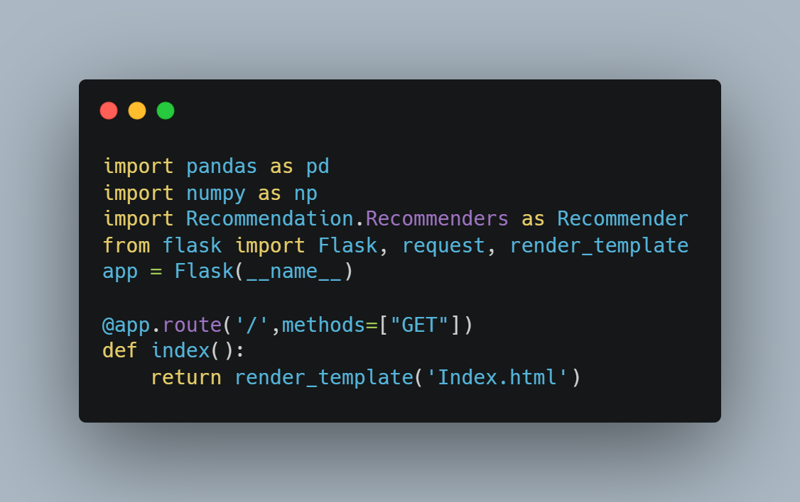
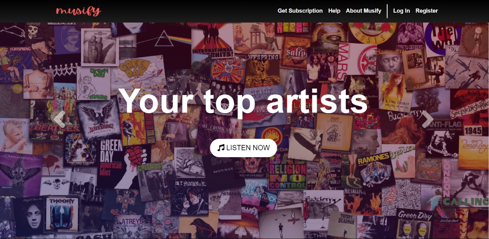

  

  

Musify is a music streaming web application that recommends
songs to the user on the basis of popularity of songs. The application was developed as a solution to challenge 3 in Microsoft engage program 22. The solution is based on machine learning and recommends the songs depending on the popularity of songs.
 
 
      
  

## Instructions

I) Make sure you have Pythons Flask framework installed in your system.

II) Extract song_data and triplets_file rar files in same directory as Project_final.py python script

III) Open Project_final.py python script and run the file.
IV)Following this use the IP address in the output terminal of your IDE or use local host IP address http://127.0.0.1:5000/

IV)Now you shall find yourself on the landing page to proceed further you can take two steps
 a)Go to Register and make an account for yourself after this visit login page and fill in your credentials
 
    or
    
b) Directly login using the credentials

 email-sshashwat09@gmail.com
 
 password-12345678

V) Now you shall find yourself on user details page fill in your first name and last name and an integral user id

VI) Now you will be redirected to recommendation page where you shall find top recommended songs on the basis of popularities

## Tech Stack
1)HTML

2)CSS

3)JavaScript

4)Python

5)Flask

## Preview

#### Code Snipet

  

#### Landing Page Prieview

  

